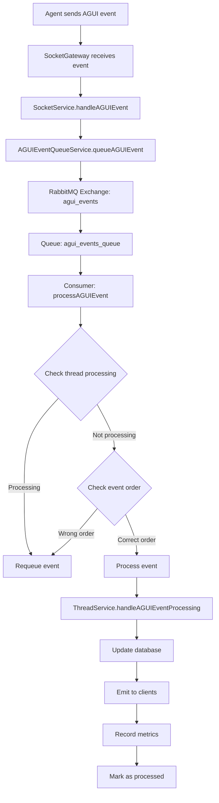

# AGUI Event Sequential Processing - Implementation Summary

## 🎯 Mục tiêu đã đạt được

Đã xây dựng thành công hệ thống xử lý tuần tự các sự kiện AGUI từ agent với các đặc điểm:

✅ **Đảm bảo thứ tự xử lý**: Các sự kiện được xử lý theo đúng thứ tự dựa trên field `order`
✅ **Tránh race conditions**: Chỉ một sự kiện được xử lý tại một thời điểm cho mỗi thread
✅ **Sử dụng RabbitMQ**: Queue mạnh mẽ với retry logic và error handling
✅ **Monitoring**: Hệ thống giám sát và thống kê chi tiết
✅ **Scalability**: Có thể scale horizontal bằng cách thêm consumers

## 📁 Các files đã tạo mới

### 1. `src/modules/socket/agui-event-queue.service.ts`
- **Chức năng**: Service chính quản lý queue và xử lý tuần tự sự kiện AGUI
- **Tính năng**:
  - Queue events vào RabbitMQ
  - Đảm bảo sequential processing per thread
  - Kiểm tra order của events
  - Retry logic và error handling

### 2. `src/modules/socket/agui-event-monitor.service.ts`
- **Chức năng**: Service giám sát và thu thập thống kê
- **Tính năng**:
  - Collect system stats mỗi phút
  - Track processing time và error rate
  - Alerts khi có vấn đề
  - Historical data storage

### 3. `scripts/test-sequential-processing.js`
- **Chức năng**: Test script để validate hệ thống
- **Tính năng**:
  - Send events out of order để test queuing
  - Verify events được xử lý theo đúng thứ tự
  - Monitor processing results

### 4. `AGUI_EVENT_SEQUENTIAL_PROCESSING.md`
- **Chức năng**: Documentation chi tiết về hệ thống

## 🔧 Các files đã được cập nhật

### 1. `src/modules/rabbitmq/rabbitmq.service.ts`
**Thêm các methods mới:**
- `publishAGUIEvent()`: Publish event với thread-specific routing
- `consumeAGUIEvents()`: Consume events với sequential processing
- `createThreadQueue()`: Tạo queue cho thread
- `deleteThreadQueue()`: Xóa queue khi thread kết thúc
- `getQueueStats()`: Lấy thống kê queue

### 2. `src/modules/thread/thread.service.ts`
**Thêm các methods mới:**
- `@OnEvent('agui.event.process')`: Event listener cho AGUI events
- `handleAGUIEventProcessing()`: Central handler cho tất cả event types
- Individual handlers cho từng loại event (RUN_STARTED, TEXT_MESSAGE_END, etc.)

### 3. `src/modules/socket/socket.service.ts`
**Cập nhật:**
- `handleAGUIEvent()`: Giờ queue events thay vì xử lý trực tiếp
- `handleAGUIEventDirectly()`: Legacy method (deprecated)

### 4. `src/modules/socket/socket.module.ts`
**Thêm:**
- `AGUIEventQueueService` và `AGUIEventMonitorService` vào providers
- `ScheduleModule` cho cron jobs

### 5. `package.json`
**Thêm dependencies:**
- `@nestjs/schedule: ^4.0.0`
- `socket.io-client: ^4.8.1` (devDependencies)
- Script `test:sequential`

## 🚀 Cách sử dụng

### 1. Cài đặt dependencies
```bash
npm install
```

### 2. Đảm bảo RabbitMQ và Redis chạy
```bash
# Using Docker
docker run -d --name rabbitmq -p 5672:5672 -p 15672:15672 rabbitmq:3-management
docker run -d --name redis -p 6379:6379 redis:alpine
```

### 3. Thiết lập environment variables
```bash
# .env
JARVIS_KIT_RABBITMQ_URI=amqp://localhost:5672
REDIS_URL=redis://localhost:6379
```

### 4. Khởi động ứng dụng
```bash
npm run start:dev
```

### 5. Test hệ thống
```bash
npm run test:sequential
```

## 📊 Monitoring

### 1. Xem system stats
```typescript
// Inject AGUIEventMonitorService
const stats = await this.monitorService.getSystemStats();
console.log(stats);
```

### 2. Xem thread stats
```typescript
const threadStats = await this.monitorService.getThreadStats('thread-id');
console.log(threadStats);
```

### 3. Xem recent errors
```typescript
const errors = await this.monitorService.getRecentErrors(10);
console.log(errors);
```

### 4. Check RabbitMQ Management UI
- URL: http://localhost:15672
- Username: guest
- Password: guest

## 🔍 Logs và Debug

### 1. Application logs
```bash
# Logs để theo dõi
[AGUIEventQueueService] Queued AGUI event for thread...
[AGUIEventQueueService] Processed AGUI event for thread...
[ThreadService] Error processing AGUI event...
```

### 2. Redis keys để debug
```bash
# Check processed order
redis-cli get "thread:{threadId}:last_processed_order"

# Check active threads
redis-cli smembers "agui_events:active_threads"

# Check error stats
redis-cli get "agui_events:total_errors"
```

### 3. RabbitMQ commands
```bash
# Check queue stats
docker exec rabbitmq rabbitmqctl list_queues

# Check consumers
docker exec rabbitmq rabbitmqctl list_consumers

# Check exchanges
docker exec rabbitmq rabbitmqctl list_exchanges
```

## 🔄 Luồng xử lý



## 🎛️ Configuration

### RabbitMQ Settings
```typescript
// Exchange
exchange: 'agui_events'
type: 'topic'
durable: true

// Queue
queue: 'agui_events_queue'
durable: true
arguments: {
  'x-message-ttl': 60000, // 1 minute
  'x-max-retries': 3
}

// Routing
pattern: 'thread.{threadId}'
```

### Redis Settings
```typescript
// Order tracking
key: 'thread:{threadId}:last_processed_order'
ttl: 24 hours

// Active threads
key: 'agui_events:active_threads'
type: 'set'

// Stats
key: 'agui_events:system_stats'
type: 'list'
ttl: 24 hours
```

## 🚨 Troubleshooting

### 1. Events bị stuck
```bash
# Check queue depth
docker exec rabbitmq rabbitmqctl list_queues | grep agui

# Check consumers
docker exec rabbitmq rabbitmqctl list_consumers | grep agui

# Restart service
npm run start:dev
```

### 2. Events out of order
```bash
# Check current order
redis-cli get "thread:your-thread-id:last_processed_order"

# Reset order (if needed)
redis-cli del "thread:your-thread-id:last_processed_order"
```

### 3. High error rate
```bash
# Check recent errors
redis-cli lrange "agui_events:recent_errors" 0 9

# Check error rate
redis-cli get "agui_events:total_errors"
redis-cli get "agui_events:total_processed"
```

## 📈 Performance Tuning

### 1. RabbitMQ
```bash
# Increase prefetch count if needed
# In RabbitMQService.consumeAGUIEvents()
await this.channel.prefetch(5); // Default: 1
```

### 2. Redis
```bash
# Increase connection pool if needed
# In app.module.ts
RedisModule.forRoot({
  config: {
    maxRetriesPerRequest: 3,
    lazyConnect: true,
    maxMemoryPolicy: 'allkeys-lru'
  }
})
```

### 3. Monitoring intervals
```typescript
// In AGUIEventMonitorService
@Cron('0 */5 * * * *') // Change to every 5 minutes
async collectSystemStats() {
  // ...
}
```

## 🔮 Future Enhancements

1. **Dead Letter Queue**: Implement DLQ for failed events
2. **Circuit Breaker**: Add circuit breaker pattern
3. **Metrics Dashboard**: Web UI for monitoring
4. **Auto-scaling**: Auto-scale consumers based on queue depth
5. **Event Replay**: Ability to replay events from specific point
6. **Multi-tenant**: Support for multiple tenants
7. **Health Checks**: Health endpoints for monitoring
8. **Distributed Tracing**: Add OpenTelemetry support

## ✅ Kết luận

Hệ thống xử lý tuần tự AGUI events đã được implement thành công với:
- **Reliability**: RabbitMQ đảm bảo message delivery
- **Scalability**: Có thể scale horizontal
- **Monitoring**: Comprehensive monitoring và alerting
- **Maintainability**: Clean architecture và good documentation
- **Testing**: Test script để validate functionality

Hệ thống sẵn sàng để production use và có thể được extend thêm các tính năng nâng cao trong tương lai.