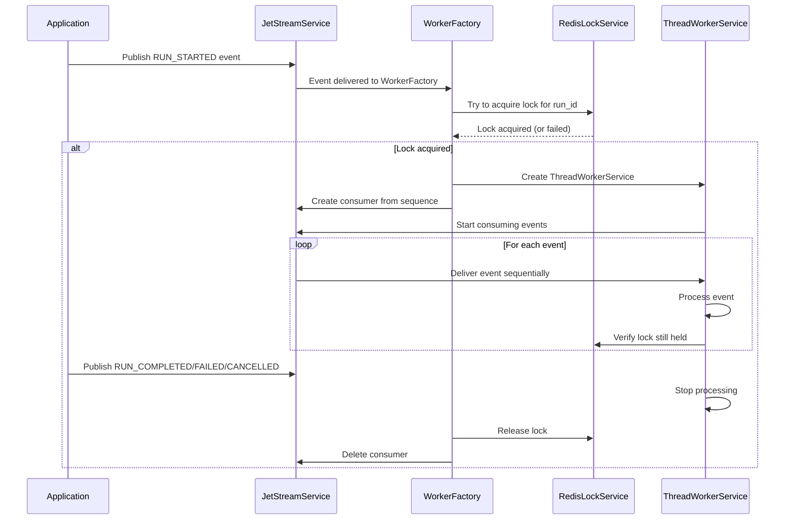

# JetStream Sequential Thread Event Processing System

## Tổng quan

Hệ thống này được thiết kế để đảm bảo các events của một thread được xử lý một cách tuần tự (sequential) trong môi trường phân tán với nhiều instances. Sử dụng NATS JetStream để lưu trữ events và Redis để quản lý distributed locks.

## Kiến trúc hệ thống

### Thành phần chính

1. **JetStreamService**: Quản lý kết nối NATS và stream operations
2. **WorkerFactory**: Lắng nghe RUN_STARTED events và tạo workers
3. **ThreadWorkerService**: Xử lý sequential events cho một thread cụ thể
4. **RedisLockService**: Quản lý distributed locks để đảm bảo chỉ một instance xử lý một run

### Luồng hoạt động



## Cài đặt và cấu hình

### Dependencies

```bash
npm install nats uuid @types/uuid ioredis
```

### Environment Variables

```env
# NATS JetStream
NATS_URL=nats://localhost:4222

# Redis
REDIS_HOST=localhost
REDIS_PORT=6379

# Instance ID (optional, auto-generated if not provided)
INSTANCE_ID=instance-001
```

### NATS JetStream Setup

Đảm bảo NATS Server có JetStream enabled:

```bash
# Start NATS with JetStream
nats-server -js
```

## Cách sử dụng

### 1. Khởi tạo một thread run

```typescript
// Sử dụng service
await jetStreamService.publishThreadEvent('thread-001', {
  type: ThreadEventType.RUN_STARTED,
  threadId: 'thread-001',
  runId: 'run-12345',
  timestamp: Date.now(),
  payload: {
    userId: 'user-123',
    agentId: 'agent-456',
    inputData: { query: 'Hello, how are you?' }
  }
});
```

```bash
# Sử dụng REST API
curl -X POST http://localhost:3000/jetstream/events/run-started \
  -H "Content-Type: application/json" \
  -d '{
    "threadId": "thread-001",
    "runId": "run-12345",
    "userId": "user-123",
    "agentId": "agent-456",
    "inputData": {
      "query": "Hello, how are you?"
    }
  }'
```

### 2. Gửi progress updates

```typescript
await jetStreamService.publishThreadEvent('thread-001', {
  type: ThreadEventType.RUN_PROGRESS,
  threadId: 'thread-001',
  runId: 'run-12345',
  timestamp: Date.now(),
  payload: {
    progress: 50,
    message: 'Processing...',
    data: { step: 2 }
  }
});
```

### 3. Hoàn thành run

```typescript
await jetStreamService.publishThreadEvent('thread-001', {
  type: ThreadEventType.RUN_COMPLETED,
  threadId: 'thread-001',
  runId: 'run-12345',
  timestamp: Date.now(),
  payload: {
    result: { response: 'Hello! I am doing well.' },
    executionTime: 5000
  }
});
```

## Monitoring và Debugging

### REST API Endpoints

#### 1. Health Check
```bash
GET /jetstream/health
```

#### 2. Active Workers
```bash
GET /jetstream/workers/active
```

#### 3. Active Locks
```bash
GET /jetstream/locks/active
```

#### 4. Stream Information
```bash
GET /jetstream/streams/info
```

#### 5. Force Stop Worker
```bash
DELETE /jetstream/workers/{runId}
```

#### 6. Force Release All Locks
```bash
DELETE /jetstream/locks/force-release-all
```

### Logs

Hệ thống sử dụng NestJS Logger với các levels:
- `log`: Thông tin quan trọng
- `debug`: Chi tiết xử lý
- `warn`: Cảnh báo
- `error`: Lỗi

## Đảm bảo tính tuần tự (Sequential Processing)

### 1. Lock Mechanism

- Mỗi `run_id` có một distributed lock trên Redis
- Chỉ instance nào acquire được lock mới được xử lý events
- Lock được auto-extend để tránh expire trong quá trình xử lý

### 2. Consumer Strategy

- WorkerFactory tạo consumer riêng cho mỗi thread
- Consumer bắt đầu từ sequence của RUN_STARTED event
- Events được deliver theo thứ tự sequence

### 3. Queue Processing

- ThreadWorkerService xử lý events trong internal queue
- Chỉ process một event tại một thời điểm
- Verify lock trước khi xử lý mỗi event

## Scaling và High Availability

### Horizontal Scaling

1. **Multiple Instances**: Có thể chạy nhiều instances
2. **Load Distribution**: WorkerFactory tự động phân phối load
3. **Failover**: Nếu instance fail, lock sẽ expire và instance khác có thể take over

### Error Handling

1. **Lock Lost**: Worker tự động stop khi mất lock
2. **Connection Issues**: Auto-reconnect với retry logic
3. **Processing Errors**: Log error nhưng tiếp tục xử lý events khác

### Data Persistence

1. **JetStream**: Events được persist với file storage
2. **Redis**: Locks có TTL để tránh deadlock
3. **Consumer State**: NATS JetStream track consumer progress

## Best Practices

### 1. Event Design

- Giữ events nhỏ gọn
- Include đầy đủ context trong payload
- Sử dụng timestamp cho ordering

### 2. Error Handling

- Implement retry logic cho critical operations
- Log đầy đủ context cho debugging
- Graceful degradation khi service unavailable

### 3. Monitoring

- Monitor active workers count
- Track lock acquisition/release
- Alert on processing delays

### 4. Testing

- Test với multiple instances
- Simulate network partitions
- Verify sequential processing

## Troubleshooting

### Common Issues

1. **Events not processed**
   - Check NATS connection
   - Verify stream configuration
   - Check consumer status

2. **Multiple instances processing same run**
   - Verify Redis connectivity
   - Check lock acquisition logs
   - Ensure unique instance IDs

3. **Processing delays**
   - Check queue length
   - Monitor lock contention
   - Verify worker health

### Debug Commands

```bash
# Check NATS stream
nats stream info JARVISKIT_STREAM

# Check Redis locks
redis-cli keys "jarviskit:thread:lock:*"

# Check application logs
docker logs -f jarviskit-runtime
```

## Performance Considerations

### Throughput

- Mỗi thread có thể xử lý events tuần tự
- Nhiều threads có thể chạy parallel
- Bottleneck chính là processing time của business logic

### Latency

- Event delivery latency: < 10ms
- Lock acquisition: < 50ms
- Processing latency phụ thuộc vào business logic

### Resource Usage

- Memory: Tỷ lệ thuận với số active workers
- CPU: Chủ yếu cho event processing
- Network: Moderate (NATS + Redis traffic)

## Security Considerations

1. **Authentication**: Cấu hình NATS và Redis authentication
2. **Authorization**: Implement proper access controls
3. **Encryption**: Sử dụng TLS cho connections
4. **Input Validation**: Validate tất cả event payloads

## Future Enhancements

1. **Metrics**: Integrate với Prometheus/Grafana
2. **Dead Letter Queue**: Xử lý failed events
3. **Batch Processing**: Optimize cho high-volume scenarios
4. **Event Sourcing**: Complete event sourcing implementation
5. **Circuit Breaker**: Implement circuit breaker pattern